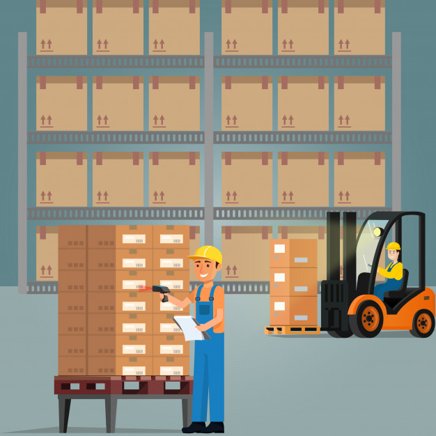

# Warehouse
A warehouse simulation that handles the selection and loading of fascia for bumpers on minivans. 

- Dependency Injection
- MVC Push Model

Designed and implemented in a group of 4.
Coursework for Software Design at University of Toronto.
